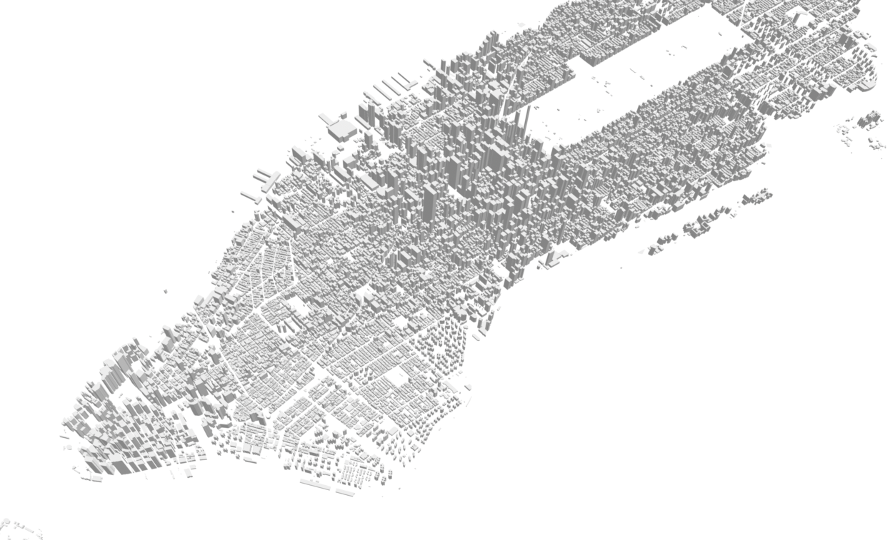
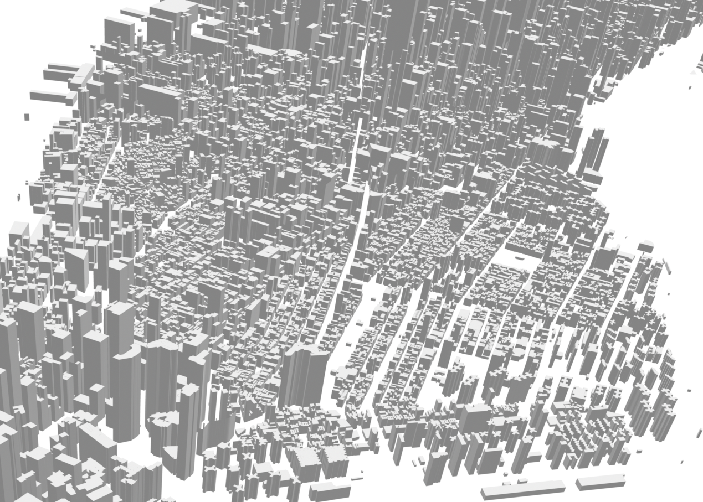

# Manhattan Extruded

This is an stl model built by extruding Manhattan buildings footprint by their respective height.

Original data is from https://data.cityofnewyork.us/Housing-Development/Building-Footprints/nqwf-w8eh

Ping me on twitter [@zats](https://twitter.com/zats) if you end up using it ❤️

